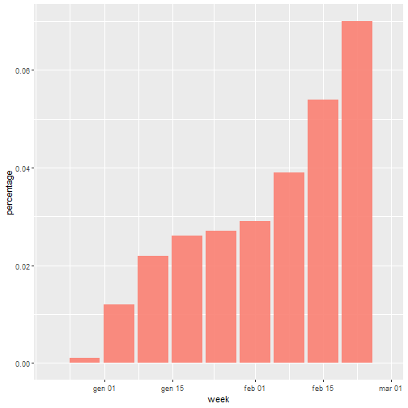
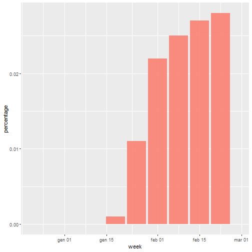
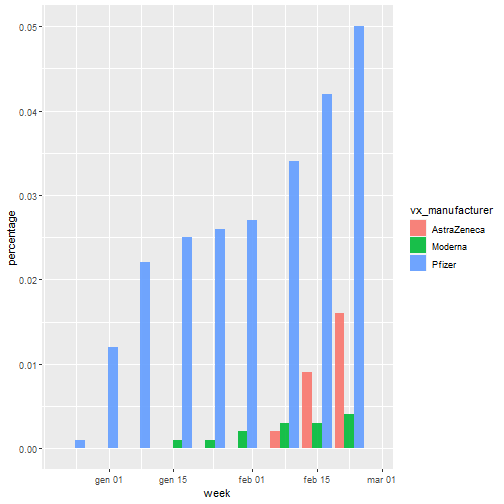
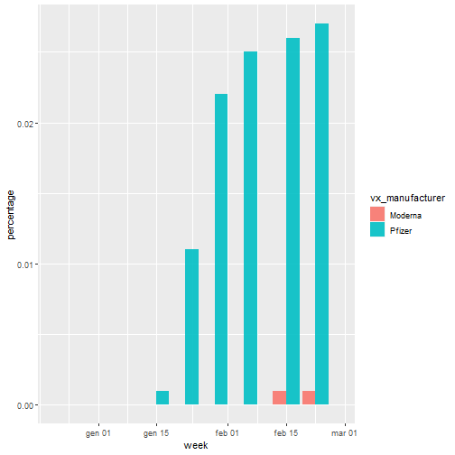

This is the description of **COVERAGE_BIRTHCOHORTS** dataset.
 
This file contains graphical tools and tables to summarize the vaccine coverage data obtained from the script. 

## Coverage

This section includes a graph showing the vaccine coverage by week, the coverage is calculated on individuals who have received at least one dose. 
The data are also shown in the subsequent table. 

|week       | dose| percentage|
|:----------|----:|----------:|
|2020-12-28 |    1|      0.001|
|2021-01-04 |    1|      0.012|
|2021-01-11 |    1|      0.022|
|2021-01-18 |    1|      0.026|
|2021-01-25 |    1|      0.027|
|2021-02-01 |    1|      0.029|
|2021-02-08 |    1|      0.039|
|2021-02-15 |    1|      0.054|
|2021-02-22 |    1|      0.070|

## Coverage dose 2

This section includes a graph showing the vaccine coverage by week, the coverage is calculated on individuals who have received the second dose. 
The data are also shown in the subsequent table.

|week       | dose| percentage|
|:----------|----:|----------:|
|2021-01-18 |    2|      0.001|
|2021-01-25 |    2|      0.011|
|2021-02-01 |    2|      0.022|
|2021-02-08 |    2|      0.025|
|2021-02-15 |    2|      0.027|
|2021-02-22 |    2|      0.028|

## Coverage by manufacturer

This section includes a graph showing the vaccine coverage by week, divided by manufacturer. The coverage is calculated on individuals who have received at least one dose. 
The data are also shown in the subsequent table. 

|week       |vx_manufacturer | dose| percentage|
|:----------|:---------------|----:|----------:|
|2020-12-28 |Pfizer          |    1|      0.001|
|2021-01-04 |Pfizer          |    1|      0.012|
|2021-01-11 |Pfizer          |    1|      0.022|
|2021-01-18 |Pfizer          |    1|      0.025|
|2021-01-18 |Moderna         |    1|      0.001|
|2021-01-25 |Pfizer          |    1|      0.026|
|2021-01-25 |Moderna         |    1|      0.001|
|2021-02-01 |Pfizer          |    1|      0.027|
|2021-02-01 |Moderna         |    1|      0.002|
|2021-02-08 |Pfizer          |    1|      0.034|
|2021-02-08 |AstraZeneca     |    1|      0.002|
|2021-02-08 |Moderna         |    1|      0.003|
|2021-02-15 |Pfizer          |    1|      0.042|
|2021-02-15 |AstraZeneca     |    1|      0.009|
|2021-02-15 |Moderna         |    1|      0.003|
|2021-02-22 |Pfizer          |    1|      0.050|
|2021-02-22 |AstraZeneca     |    1|      0.016|
|2021-02-22 |Moderna         |    1|      0.004|

## Coverage dose 2 by manufacturer

This section includes a graph showing the vaccine coverage by week, divided by manufacturer. The coverage is calculated on individuals who have received the second dose. 
The data are also shown in the subsequent table. 

|week       |vx_manufacturer | dose| percentage|
|:----------|:---------------|----:|----------:|
|2021-01-18 |Pfizer          |    2|      0.001|
|2021-01-25 |Pfizer          |    2|      0.011|
|2021-02-01 |Pfizer          |    2|      0.022|
|2021-02-08 |Pfizer          |    2|      0.025|
|2021-02-15 |Pfizer          |    2|      0.026|
|2021-02-15 |Moderna         |    2|      0.001|
|2021-02-22 |Pfizer          |    2|      0.027|
|2021-02-22 |Moderna         |    2|      0.001|

