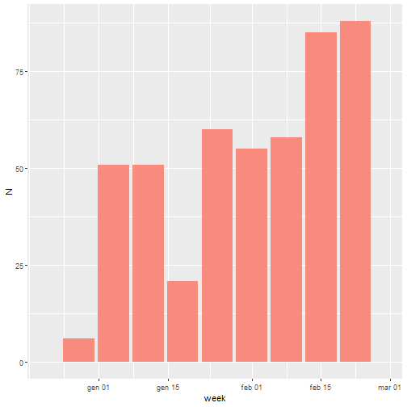
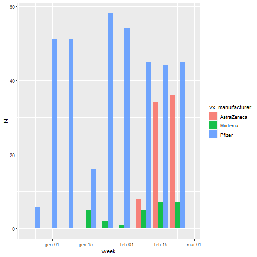
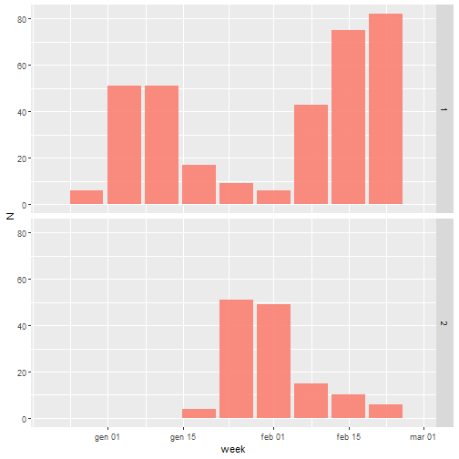
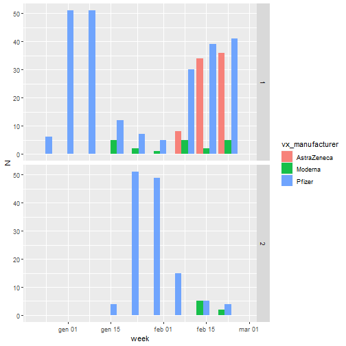

This is the description of **DOSES_BIRTHCOHORTS** dataset.
 
This file contains graphical tools and tables to summarize the number of vaccines administered data obtained from the script. 

## Number of vaccines

This section includes a graph showing the number of vaccine administered by week. 
The data are also shown in the subsequent table. 

|week       |  N|
|:----------|--:|
|2020-12-28 |  6|
|2021-01-04 | 51|
|2021-01-11 | 51|
|2021-01-18 | 21|
|2021-01-25 | 60|
|2021-02-01 | 55|
|2021-02-08 | 58|
|2021-02-15 | 85|
|2021-02-22 | 88|

## Number of vaccines by manufacturer

This section includes a graph showing the number of vaccine administered by week, divided by manifacturer. 
The data are also shown in the subsequent table. 

|week       |vx_manufacturer |  N|
|:----------|:---------------|--:|
|2020-12-28 |Pfizer          |  6|
|2021-01-04 |Pfizer          | 51|
|2021-01-11 |Pfizer          | 51|
|2021-01-18 |Pfizer          | 16|
|2021-01-18 |Moderna         |  5|
|2021-01-25 |Pfizer          | 58|
|2021-01-25 |Moderna         |  2|
|2021-02-01 |Pfizer          | 54|
|2021-02-01 |Moderna         |  1|
|2021-02-08 |Pfizer          | 45|
|2021-02-08 |AstraZeneca     |  8|
|2021-02-08 |Moderna         |  5|
|2021-02-15 |Pfizer          | 44|
|2021-02-15 |AstraZeneca     | 34|
|2021-02-15 |Moderna         |  7|
|2021-02-22 |Pfizer          | 45|
|2021-02-22 |AstraZeneca     | 36|
|2021-02-22 |Moderna         |  7|

## Number of vaccines by dose

This section includes a graph showing the number of vaccine administered by week, divided by dose number. 
The data are also shown in the subsequent table.

|week       | dose|  N|
|:----------|----:|--:|
|2020-12-28 |    1|  6|
|2021-01-04 |    1| 51|
|2021-01-11 |    1| 51|
|2021-01-18 |    1| 17|
|2021-01-18 |    2|  4|
|2021-01-25 |    1|  9|
|2021-01-25 |    2| 51|
|2021-02-01 |    1|  6|
|2021-02-01 |    2| 49|
|2021-02-08 |    1| 43|
|2021-02-08 |    2| 15|
|2021-02-15 |    1| 75|
|2021-02-15 |    2| 10|
|2021-02-22 |    1| 82|
|2021-02-22 |    2|  6|

## Number of vaccines by dose and by manufacturer

This section includes a graph showing the number of vaccine administered by week, divided by manifacturer and by dose number. 
The data are also shown in the subsequent table.

|week       |vx_manufacturer | dose|  N|
|:----------|:---------------|----:|--:|
|2020-12-28 |Pfizer          |    1|  6|
|2021-01-04 |Pfizer          |    1| 51|
|2021-01-11 |Pfizer          |    1| 51|
|2021-01-18 |Pfizer          |    1| 12|
|2021-01-18 |Pfizer          |    2|  4|
|2021-01-18 |Moderna         |    1|  5|
|2021-01-25 |Pfizer          |    1|  7|
|2021-01-25 |Pfizer          |    2| 51|
|2021-01-25 |Moderna         |    1|  2|
|2021-02-01 |Pfizer          |    1|  5|
|2021-02-01 |Pfizer          |    2| 49|
|2021-02-01 |Moderna         |    1|  1|
|2021-02-08 |Pfizer          |    1| 30|
|2021-02-08 |Pfizer          |    2| 15|
|2021-02-08 |AstraZeneca     |    1|  8|
|2021-02-08 |Moderna         |    1|  5|
|2021-02-15 |Pfizer          |    1| 39|
|2021-02-15 |Pfizer          |    2|  5|
|2021-02-15 |AstraZeneca     |    1| 34|
|2021-02-15 |Moderna         |    1|  2|
|2021-02-15 |Moderna         |    2|  5|
|2021-02-22 |Pfizer          |    1| 41|
|2021-02-22 |Pfizer          |    2|  4|
|2021-02-22 |AstraZeneca     |    1| 36|
|2021-02-22 |Moderna         |    1|  5|
|2021-02-22 |Moderna         |    2|  2|

