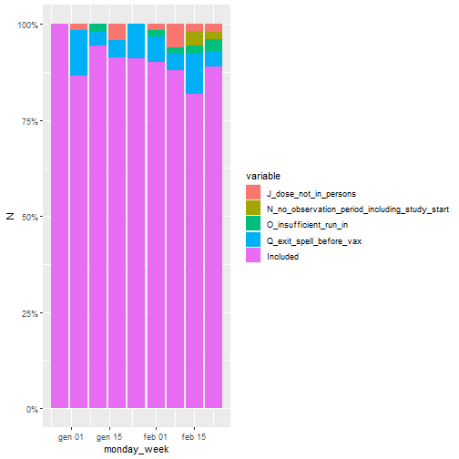

This is a description of the Flow Chart.

## Exclusion criteria graph

The next graph shows the proportion of doses included in the study and the proportion of doses excluded. 
Different colors correspond to different exclusion criteria. 
 

## Exclusion criteria table

In the next table each column represents an exclusion criteria and each row represents a week. 
The values in the table refer to the number of doses excluded by the corresponding criteria in that week.
 

|monday_week | J_dose_not_in_persons| N_no_observation_period_including_study_start| O_insufficient_run_in| Q_exit_spell_before_vax| Included|
|:-----------|---------------------:|---------------------------------------------:|---------------------:|-----------------------:|--------:|
|2020-12-28  |                     0|                                             0|                     0|                       0|        6|
|2021-01-04  |                     1|                                             0|                     0|                       7|       51|
|2021-01-11  |                     0|                                             0|                     1|                       2|       51|
|2021-01-18  |                     1|                                             0|                     0|                       1|       21|
|2021-01-25  |                     0|                                             0|                     0|                       6|       60|
|2021-02-01  |                     1|                                             0|                     1|                       4|       55|
|2021-02-08  |                     4|                                             0|                     1|                       3|       58|
|2021-02-15  |                     2|                                             4|                     2|                      11|       85|
|2021-02-22  |                     2|                                             2|                     3|                       4|       88|

## Sum of excluded

| J_dose_not_in_persons| N_no_observation_period_including_study_start| O_insufficient_run_in| Q_exit_spell_before_vax| Included|
|---------------------:|---------------------------------------------:|---------------------:|-----------------------:|--------:|
|                    11|                                             6|                     8|                      38|      475|

